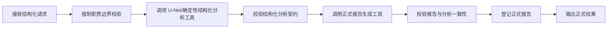

# 医院生产环境 AI 边界与策略图说明

## 1. 目标

本文用于明确当前医疗影像 AI 链路在医院生产环境中的职责边界，核心目标是：

- 严禁 LLM 代替 U-Net 或其他确定性结构化分析工具执行医学影像分析
- 严禁 LLM 生成、改写、补全正式影像分析结论
- 严禁 LLM 在结构化分析失败时“补一个像诊断一样的答案”
- 将“影像分析”和“正式报告生成”严格拆分为两个受控阶段

## 2. 角色边界

### 2.1 U-Net / 结构化分析工具

允许承担的职责：

- 读取影像输入
- 执行分割或确定性分析
- 生成结构化指标
- 生成高亮区域、轮廓、边界框
- 输出正式结构化分析结果

禁止承担之外的职责：

- 不负责自由文本问答
- 不负责面向用户的自然语言扩写

### 2.2 报告生成工具

允许承担的职责：

- 严格消费结构化分析结果
- 生成正式 PDF / Markdown 报告
- 保持分析结果与报告字段一致
- 生成受控格式的图文输出

禁止承担之外的职责：

- 不自行重新推理影像
- 不凭自由文本生成分析结论

### 2.3 LLM

允许承担的职责：

- 对既有正式报告或结构化指标做说明
- 对受控输出做非诊断性的文本解释
- 对用户提问做范围提示与边界提醒

明确禁止的职责：

- 分割影像
- 生成诊断性影像分析结论
- 改写正式结构化分析结果
- 在正式分析失败时顶替 U-Net 给出“看起来像结论”的内容
- 生成未经结构化分析支撑的正式报告

## 3. 新的受控策略图

## 4. 策略图的强制规则

### 4.1 输入阶段

- 必须包含影像路径、模态、医院ID、患者ID、患者姓名
- 未知模态不允许进入正式分析
- 自由文本说明不能直接影响正式影像结论

### 4.2 分析阶段

- 只能由 U-Net 或其他确定性结构化分析工具输出结果
- 分析输出必须可反序列化为结构化 payload
- 分析结果必须与请求中的医院/患者/模态一致
- 分析结果若带错误信息，则禁止进入正式报告阶段

### 4.3 报告阶段

- 只能消费已经通过校验的结构化分析结果
- 报告工具不得接受兼容模式或裸分析 DTO 作为正式报告输入
- 报告中的分析ID、患者ID、医院ID必须与分析结果一致
- 报告状态必须为 `generated`
- 报告正文不能为空

### 4.4 失败阶段

- 只允许返回失败说明或人工复核提示
- 不允许触发 LLM 代替正式影像分析
- 不允许生成“基础 AI 结论”作为替代

## 5. 当前代码中的落地点

### 5.1 策略图

- `metric-service/src/main/kotlin/aiagent/strategy/StrategyGraph.kt`

当前已改为：

- 受控请求受理子图
- 受控结构化分析子图
- 正式报告生成子图

并且策略图与实际运行入口共用同一套受控流水线函数。

### 5.2 路由入口

- `metric-service/src/main/kotlin/Routing.kt`

当前已改为：

- 图片分析只走受控结构化流水线
- 结构化流水线失败时，不再回退到 LLM 生成影像分析
- 文本讨论回复中明确声明 LLM 不执行分割、不生成诊断结论、不改写正式结果
- 正式报告阶段仅接收结构化分析 payload，不再接受兼容模式输入

### 5.3 分割服务对接

- `metric-service/src/main/kotlin/aiagent/tools/SegmentationServiceClient.kt`
- `metric-service/src/main/kotlin/aiagent/tools/MedicalImageAnalyzerTool.kt`

当前正式影像分析链路已对接独立 Python `segmentation-service`：

- `metric-service` 默认调用 `segmentation-service` 的 `POST /api/v1/segment`
- 分割服务返回的结构化区域、质量门禁、模型信息和工件路径会映射为正式分析 payload
- 分割服务不可用、契约不匹配、质量门禁失败或无结构化区域时，链路失败并进入人工复核提示
- 不允许在分割服务失败时回退到 LLM 生成医学结论

### 5.4 LLM 配置

- `metric-service/src/main/kotlin/Application.kt`

当前已明确：

- DeepSeek/Koog 仅为后续非诊断文本能力预留
- 不参与正式影像分析与正式报告生成

## 6. 医院生产环境执行原则

上线前应确保以下原则被持续满足：

1. 任一正式影像分析结果都能追溯到结构化分析工具或 U-Net
2. 任一正式报告都能追溯到已校验的结构化分析结果
3. 任一 LLM 输出都不能伪装成正式影像分析结果
4. 任一分析失败都只能返回失败说明和人工复核提示
5. 任一边界变化都必须同步更新策略图、代码和测试

## 7. 最终结论

医院生产环境的边界必须是硬边界，不是提示性边界。

因此当前链路的原则是：

- U-Net / 结构化工具负责分析
- 报告工具负责出具正式报告
- LLM 只负责解释，不负责诊断，不负责分割，不负责补结论
