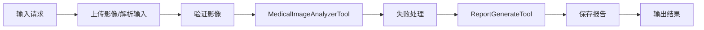
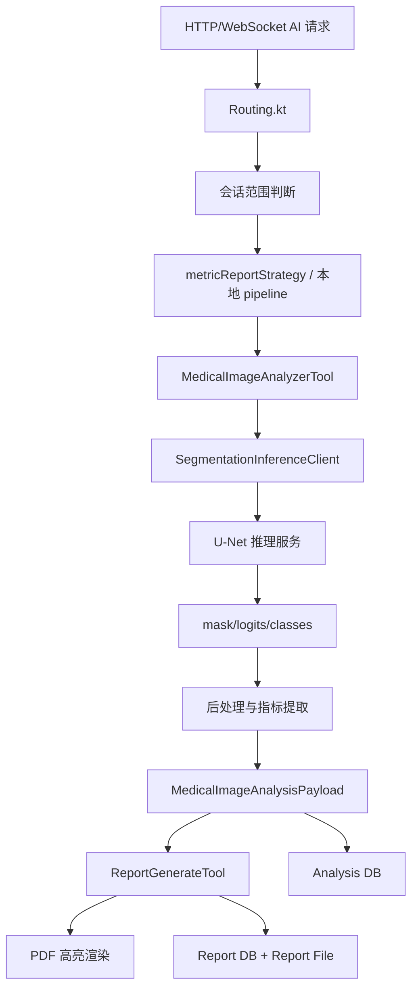
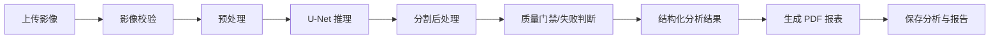

# U-Net 集成到当前 AI 链路的规划文档

## 1. 文档目的

本文基于当前 `metric-service` 中已经落地的 AI 策略图、工具链和报表生成能力，规划如何将生产环境使用的 U-Net 影像分割专用模型集成到现有 AI 链路中。

目标不是推翻当前链路，而是在尽量复用现有编排、报表和存储能力的前提下，把当前用于联调替代的 DeepSeek/启发式分析链路，平滑演进为“分割模型推理 + 结构化后处理 + 报表生成”的生产链路。

## 2. 当前链路现状

### 2.1 请求入口与执行模式

当前 AI 请求入口在：

- `metric-service/src/main/kotlin/Routing.kt`

现状特点：

- HTTP 入口：`POST /ai/analyze-and-report`
- WebSocket 入口：`/ws/ai-agent`
- 请求统一承载在 `MetricAiSocketRequest`
- 进入 AI 处理前，会先做会话范围判断：`IMAGE_ANALYSIS`、`METRIC_DISCUSSION`、`UNSUPPORTED`
- 对图片分析请求，当前优先走本地链路 `runLocalMetricPipeline`
- 只有本地链路失败且配置了 DeepSeek 时，才会进入 Koog Agent + `metricReportStrategy`

这意味着当前系统实际上已经具备一个很清晰的分层：

1. 请求接入层：HTTP / WebSocket
2. 编排层：Koog Strategy / 本地 pipeline
3. 工具层：图像分析工具、报表生成工具
4. 输出层：结构化分析结果、PDF 报表、数据库持久化

### 2.2 当前策略图

当前策略图定义在：

- `metric-service/src/main/kotlin/aiagent/strategy/StrategyGraph.kt`

现有子图顺序为：

1. 上传医学影像子图
2. 医学影像分析子图
3. 生成报表子图

对应逻辑可概括为：



这个结构对 U-Net 集成是有利的，因为真正需要替换的核心点主要集中在 `MedicalImageAnalyzerTool`，而不是整个 Agent 编排。

### 2.3 当前图像分析工具的真实能力

当前分析工具定义在：

- `metric-service/src/main/kotlin/aiagent/tools/MedicalImageAnalyzerTool.kt`

现状不是调用真实医学分割模型，而是：

- 支持本地文件、`data:` URL、`inline-image://` 引用
- 读取栅格图像后做启发式像素分析
- 输出 `MetricDto`、`summary`、`findings`
- 生成 `highlightRegions` 和 `highlightLegend`
- 将结果封装为 `MedicalImageAnalysisPayload`

因此，当前工具实际上已经承担了未来 U-Net 集成后仍然必须保留的职责：

- 图像源读取
- 输入校验
- 推理结果标准化
- 高亮区域生成
- 结构化指标生成
- 下游报表消费契约输出

差别只在于“分析引擎”现在是本地启发式逻辑，未来应替换为真实 U-Net 分割推理。

### 2.4 当前报表工具对分割结果的依赖

当前报表生成相关代码在：

- `metric-service/src/main/kotlin/aiagent/tools/ReportGenerateTool.kt`
- `metric-service/src/main/kotlin/aiagent/tools/PdfReportRenderer.kt`

当前 PDF 渲染已经支持消费：

- `highlightRegions`
- `highlightLegend`
- `contour`
- `boundingBox`

也就是说，只要 U-Net 输出最终能被转换为当前 `HighlightRegion` 结构，现有 PDF 高亮叠加和图例能力可以直接复用。

### 2.5 当前数据契约与持久化现状

相关代码：

- `shared/src/main/kotlin/dto/MetricDto.kt`
- `shared/src/main/kotlin/dto/AnalysisResultDto.kt`
- `metric-service/src/main/kotlin/aiagent/tools/ToolPayloads.kt`
- `metric-service/src/main/kotlin/database/table/AnalysisResults.kt`

当前特点：

- `AnalysisResultDto.AnalysisResultComplete.metrics` 是 `MetricDto`
- `analysis_results.metrics` 以 JSON 文本存储
- `MedicalImageAnalysisPayload` 可承载高亮区域、摘要、建议、限制项

问题在于：

- 当前 DTO 没有显式表达分割模型版本、mask 路径、类别索引、阈值、推理耗时
- 当前 `MetricDto` 更偏“检查指标”，不完全等同于“分割结果”
- 当前数据库结构适合兼容存储，但不适合长期支撑分割产物治理

## 3. 集成目标

将当前 AI 链路演进为以下生产模式：

1. 输入医学影像后，由专用 U-Net 模型完成病灶/区域分割
2. 分割结果经过后处理，转换为统一结构化 payload
3. 现有报表工具继续消费统一 payload，生成高亮 PDF
4. LLM 从“代替分析核心”降级为“编排、解释、兜底和文本交互能力”
5. 链路具备模型版本治理、灰度切换、推理监控和失败降级机制

## 4. 设计原则

### 4.1 模型推理与 Agent 编排解耦

U-Net 属于专用分割模型，生产集成不建议直接把模型运行时硬塞进当前 Kotlin/JVM 进程。更合理的方案是：

- Kotlin 侧继续负责业务编排
- Python/推理服务侧负责模型推理

原因：

- U-Net 的实际训练与部署生态通常在 Python
- 预处理、后处理、GPU 资源管理更适合独立推理服务
- 更便于模型版本迭代和 A/B 测试
- 避免 `metric-service` 承担 GPU 推理依赖和运维复杂度

### 4.2 尽量保持报表契约稳定

当前 `ReportGenerateTool` 和 `PdfReportRenderer` 已经围绕 `highlightRegions` 工作。U-Net 集成时应优先复用这一层，而不是直接改写报表工具。

核心思路：

- 模型原始输出是 mask / logits / class map
- 工具层负责把模型输出转换成现有报表可消费的 `HighlightRegion`

### 4.3 让 LLM 退出强依赖路径

在生产链路中，影像分析结果应由 U-Net 和确定性后处理生成，不能依赖 DeepSeek 或其他通用大模型“推断”影像结论。

LLM 更适合承担：

- 会话交互
- 用户意图识别
- 解释性文案润色
- 非关键路径的文本总结
- 故障兜底说明

### 4.4 保留联调与降级路径

即使生产切到 U-Net，也应保留：

- 当前本地启发式链路作为开发环境 mock
- DeepSeek 文本交互能力作为非核心链路
- 推理不可用时的明确降级响应

## 5. 目标架构

建议的目标架构如下：



推荐拆分为 5 层：

1. 接入层：`Routing.kt` 中的 HTTP / WebSocket
2. 编排层：`metricReportStrategy` 与 `runLocalMetricPipeline`
3. 分析工具适配层：`MedicalImageAnalyzerTool`
4. 模型推理层：独立 U-Net 推理服务
5. 消费层：`ReportGenerateTool`、数据库、报表文件

## 6. 推荐的集成方案

### 6.1 方案选择

推荐采用：

- `metric-service` 保持 Kotlin 编排
- 新增独立的 U-Net 推理服务
- `MedicalImageAnalyzerTool` 改造成“多后端分析工具”

不推荐第一阶段直接做的方案：

- 在 Kotlin 服务中直接加载 Python 推理环境
- 让 DeepSeek 直接替代分割判断
- 让前端自己做分割结果拼装

### 6.2 推理服务形态建议

推理服务可以是以下任一形态：

1. Python FastAPI 服务
2. TorchServe / Triton 包装的推理网关
3. 医院私有 GPU 环境上的内部推理服务

对当前项目最现实的第一阶段建议是：

- 先定义一个简单稳定的 HTTP/gRPC 推理接口
- 由 `metric-service` 调用
- 后续再替换底层部署形态，不影响业务层

## 7. 对当前代码的具体改造点

### 7.1 `MedicalImageAnalyzerTool` 从“启发式分析器”升级为“分割适配器”

当前文件：

- `metric-service/src/main/kotlin/aiagent/tools/MedicalImageAnalyzerTool.kt`

建议改造成以下职责：

1. 输入标准化
2. 图像读取与格式识别
3. 调用推理服务
4. 后处理模型输出
5. 产出统一 `MedicalImageAnalysisPayload`

建议内部新增抽象：

- `SegmentationInferenceClient`
- `SegmentationPreprocessor`
- `SegmentationPostProcessor`
- `SegmentationMetricExtractor`
- `SegmentationBackendSelector`

建议的逻辑结构：

```text
MedicalImageAnalyzerTool
  -> loadSource()
  -> preprocess()
  -> inferenceClient.segment()
  -> postProcessMask()
  -> extractMetrics()
  -> buildHighlightRegions()
  -> buildMedicalImageAnalysisPayload()
```

### 7.2 引入后端选择机制

建议为 `MedicalImageAnalyzerTool` 增加分析后端配置，例如：

- `HEURISTIC`
- `UNET_REMOTE`
- `UNET_LOCAL`

用途：

- 开发环境继续跑启发式 mock
- 测试环境对接真实 U-Net
- 生产环境强制走 U-Net

配置建议：

- `metric-service/src/main/resources/application.conf`

可新增：

```hocon
aiInference {
  backend = ${?AI_INFERENCE_BACKEND} # HEURISTIC / UNET_REMOTE
  timeoutMs = 30000
  retryCount = 1
  unet {
    endpoint = ${?UNET_INFERENCE_ENDPOINT}
    apiKey = ${?UNET_INFERENCE_API_KEY}
    modelName = ${?UNET_MODEL_NAME}
    modelVersion = ${?UNET_MODEL_VERSION}
  }
}
```

### 7.3 策略图从“调用工具”升级为“显式推理阶段”

当前 `metricReportStrategy` 虽然能工作，但对生产模型链路而言还不够细。

建议将分析子图细化为：

1. 影像接入与校验
2. 预处理
3. U-Net 推理
4. 结果后处理
5. 质量门禁
6. 报表生成

推荐的新策略图：



这里的重点不是一定要把每一步都做成独立网络调用，而是把生产链路中的关键控制点从文档和代码层面显式化。

### 7.4 `ReportGenerateTool` 基本保持不动

当前文件：

- `metric-service/src/main/kotlin/aiagent/tools/ReportGenerateTool.kt`

建议第一阶段尽量不改其主流程，只做两类增强：

1. 接收更多分割元数据
2. 在报告中展示模型来源信息

比如新增展示：

- 模型名称
- 模型版本
- 推理时间
- 分割类别
- 阈值/后处理策略
- 是否为人工复核前结果

这样可以保证：

- 报告输出快速继承现有能力
- U-Net 集成的主要风险集中在分析工具，不扩散到 PDF 生成全链路

## 8. 推理接口契约建议

建议为独立推理服务定义稳定契约。

### 8.1 请求示例

```json
{
  "requestId": "req-123",
  "hospitalId": "H-001",
  "patientId": "P-001",
  "patientName": "张三",
  "imageType": "CT",
  "image": {
    "sourceType": "LOCAL_FILE",
    "path": "/data/images/ct-001.png"
  },
  "options": {
    "returnMask": true,
    "returnContour": true,
    "returnMetrics": true
  }
}
```

生产环境更推荐的图片输入不是前端直接传超大 base64，而是：

- 本地受控文件路径
- 对象存储 URI
- DICOM 文件或序列地址

### 8.2 响应示例

```json
{
  "success": true,
  "model": {
    "name": "unet-lesion-seg",
    "version": "2026.04.1"
  },
  "timing": {
    "preprocessMs": 120,
    "inferenceMs": 340,
    "postprocessMs": 95
  },
  "classes": [
    {
      "classId": 1,
      "className": "lesion",
      "confidence": 0.94,
      "coveragePercent": 6.8,
      "estimatedSizeMm": 18.4,
      "boundingBox": {
        "leftPercent": 31.2,
        "topPercent": 28.5,
        "widthPercent": 19.4,
        "heightPercent": 16.7
      },
      "contour": [
        { "xPercent": 31.4, "yPercent": 29.0 },
        { "xPercent": 32.1, "yPercent": 28.7 },
        { "xPercent": 33.0, "yPercent": 29.1 }
      ]
    }
  ],
  "artifacts": {
    "maskPath": "s3://bucket/case-001/mask.png",
    "overlayPath": "s3://bucket/case-001/overlay.png"
  }
}
```

## 9. U-Net 输出到当前 payload 的映射方案

为了最大限度复用现有代码，建议把 U-Net 推理结果映射为当前 `MedicalImageAnalysisPayload`。

### 9.1 推荐映射关系

U-Net 输出字段到当前字段的映射：

- `className` -> `HighlightRegion.label` / `annotationTitle`
- `confidence` -> `HighlightRegion.confidence`
- `coveragePercent` -> `HighlightRegion.coveragePercent`
- `estimatedSizeMm` -> `HighlightRegion.estimatedSizeMm`
- `boundingBox` -> `HighlightBoundingBox`
- `contour` -> `HighlightContourPoint`
- `model classes` -> `highlightLegend`

### 9.2 指标生成策略

U-Net 原始结果不一定直接等于当前 `MetricDto`，因此建议增加一个“派生指标提取”步骤，把分割结果转换为可落库、可解释的业务指标，例如：

- 病灶最大径
- 面积
- 体积
- 覆盖率
- 左右侧/解剖区位
- 多病灶数量
- 分割置信度

然后按影像类型映射为当前 `MetricDto`：

- CT -> `CTMetric`
- MRI -> `MRIMetric`
- XRAY -> `XRayMetric`
- Ultrasound -> `UltrasoundMetric`
- 多指标场景 -> `MetricCollection`

如果某些分割结果无法自然映射到现有 DTO，建议第二阶段新增专门的分割指标 DTO，而不是长期硬塞进现有字段。

## 10. 数据模型演进建议

### 10.1 第一阶段：兼容现有表结构

为了快速落地，第一阶段可以继续使用：

- `analysis_results.metrics` 存储派生指标 JSON
- `MedicalImageAnalysisPayload` 承载高亮区域与补充信息

同时新增以下字段到 payload：

- `modelName`
- `modelVersion`
- `backendType`
- `maskPath`
- `overlayPath`
- `inferenceMs`
- `preprocessMs`
- `postprocessMs`
- `qualityGateStatus`

这一步可以先不扩表，优先保证链路打通。

### 10.2 第二阶段：补充分割专用持久化结构

建议新增一张或一组分割专用表，例如：

- `segmentation_runs`
- `segmentation_artifacts`

建议字段包括：

- `analysis_id`
- `model_name`
- `model_version`
- `backend_type`
- `input_source`
- `mask_path`
- `overlay_path`
- `raw_response`
- `preprocess_ms`
- `inference_ms`
- `postprocess_ms`
- `threshold_config`
- `status`
- `error_message`

这样做的价值：

- 支撑问题回溯
- 支撑模型版本对比
- 支撑质控与复盘
- 支撑后续标注闭环

## 11. 输入源与文件流转改造建议

当前 `MetricAiSocketRequest.imageData` 支持 base64 图片，但对生产分割链路不够理想。

建议分阶段演进：

### 第一阶段

- 继续兼容 `imageData`
- 后端收到图片后先落受控目录或对象存储
- 后续分析只传文件引用，不在链路内反复搬运大块 base64

### 第二阶段

- 前端先上传影像
- AI 请求只传 `imageId` / `filePath` / `objectKey`
- U-Net 推理直接读取稳定影像源

对于 CT/MRI，若后续要支持 DICOM 序列，建议不要继续使用当前单张栅格图像假设，而应在推理服务侧支持：

- 单张 PNG/JPG
- 单个 DICOM
- DICOM 序列 / study

## 12. 质量门禁与失败处理

生产分割链路必须有明确的质量门禁，而不能只要模型返回就直接出报告。

建议在 `MedicalImageAnalyzerTool` 后处理中增加质量门禁：

- 图像不可读
- 输入模态不匹配
- 分割结果为空
- mask 面积异常过大/过小
- 轮廓不可闭合
- 置信度低于阈值
- 推理服务超时

质量门禁结果建议分为：

- `PASS`
- `LIMITED`
- `FAIL`

对应行为：

- `PASS`: 进入正式报表
- `LIMITED`: 生成带限制说明的报表
- `FAIL`: 返回失败结果，不生成正式分析结论

这比当前简单的 `"completed"` / `"limited"` 更适合生产模型治理。

## 13. 对 DeepSeek 的角色调整建议

当前 DeepSeek 在 `Application.kt` 和 `Routing.kt` 中仍然承担 Agent 模型角色，但生产接入 U-Net 后，建议重定义其职责：

- 不再负责核心影像分析
- 只负责文本交互和说明性文案
- 在推理成功后，基于结构化结果生成面向用户的解释性文字
- 在推理失败时生成合规的失败说明

建议未来把链路改造成：

- U-Net 负责“看图”
- Kotlin 工具负责“转结构化结果”
- DeepSeek 负责“说人话”

## 14. 分阶段实施计划

### Phase 0：方案冻结

目标：

- 确认 U-Net 服务调用方式
- 确认输入格式
- 确认输出字段
- 确认模型版本管理方式

产出：

- 推理服务接口文档
- 字段映射表
- 灰度策略说明

### Phase 1：工具层接入 U-Net

目标：

- 在 `MedicalImageAnalyzerTool` 中引入 `UNET_REMOTE` 后端
- 保留 `HEURISTIC` 作为 mock
- 打通从影像输入到 `MedicalImageAnalysisPayload` 的真实分割链路

验收标准：

- 能对接真实 U-Net 服务
- 能输出 `highlightRegions`
- 能继续生成 PDF 报表
- 现有本地测试链路不被破坏

### Phase 2：数据与观测补强

目标：

- 增加模型元数据和推理耗时
- 新增分割工件存储
- 增加日志、指标、错误码

验收标准：

- 可以追踪每次分析使用的模型版本
- 可以定位超时、空 mask、低置信度等失败原因
- 可以查询 mask/overlay 产物

### Phase 3：策略图显式化与灰度

目标：

- 将策略图升级为显式“预处理/推理/后处理/质控/报表”链路
- 支持按医院、科室、影像类型切换后端

验收标准：

- 可以按配置灰度切换 `HEURISTIC` 与 `UNET_REMOTE`
- 可以按模态启用不同模型
- 失败时有稳定降级路径

### Phase 4：DTO 与持久化升级

目标：

- 引入分割专用 DTO 或专用表
- 支撑长期模型治理和审计

验收标准：

- 历史分析可追溯到模型版本和推理参数
- 报表、分析结果、分割工件之间可关联

## 15. 测试与验收建议

### 15.1 单元测试

重点覆盖：

- U-Net 响应到 `HighlightRegion` 的映射
- contour / boundingBox 百分比换算
- 空分割、低置信度、异常返回处理
- 后端选择器逻辑

可以沿用并扩展当前测试文件：

- `metric-service/src/test/kotlin/aiagent/tools/MedicalImageToolChainTest.kt`

### 15.2 集成测试

重点覆盖：

- `Routing.kt` 的 HTTP / WebSocket AI 请求
- 调用推理服务后的完整报表生成
- PDF 中高亮附图是否仍可生成

### 15.3 回归测试

必须验证：

- 当前启发式 mock 模式仍可用于本地联调
- 现有 `ReportGenerateTool` 不因 payload 扩展而失效
- 现有 `analysis_results` / `reports` 的读写不回归

## 16. 主要风险与应对

### 风险 1：输入格式与模型预处理不一致

问题：

- 当前工具默认面向普通栅格图
- 真实 U-Net 可能需要 DICOM、窗宽窗位、归一化策略

应对：

- 把预处理下沉到推理服务
- Kotlin 侧只做最小必要的输入标准化

### 风险 2：模型输出无法自然映射到当前 DTO

问题：

- `MetricDto` 更偏“检查结论指标”
- 分割模型输出更偏“区域级结果”

应对：

- 第一阶段做派生指标映射
- 第二阶段引入分割专用 DTO

### 风险 3：报告与分割结果耦合不清

问题：

- 若直接把 mask 原始格式暴露给报表层，会让耦合失控

应对：

- 坚持由工具层统一转换为 `HighlightRegion`
- 报表层只消费标准高亮结构

### 风险 4：模型服务不可用导致主链路中断

应对：

- 超时控制
- 重试一次
- 明确 `LIMITED/FAIL` 状态
- 保留 mock / 兜底文案能力

## 17. 最终建议

结合当前项目结构，最合理的实施路径是：

1. 保留当前 `Routing.kt + StrategyGraph + ReportGenerateTool` 的主体结构
2. 把 `MedicalImageAnalyzerTool` 改造成 U-Net 推理适配层
3. 通过独立推理服务承载真实 U-Net 模型
4. 继续复用 `highlightRegions` 作为报表渲染标准接口
5. 逐步补齐模型元数据、分割工件、质量门禁和持久化结构

一句话概括：

当前链路不需要重写，只需要把“分析工具”从启发式实现替换为“U-Net 推理 + 后处理 + 标准化输出”，再围绕该能力补齐生产治理即可。
